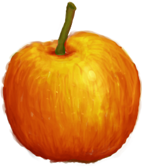

# RPG-Game

<p align="center">
  
</p>

<h1 align="center">
  Little Red Ridding Hood
</h1>

> Final Microverse JS Capstone Project

<p align="center">
  <br>
   <a href="https://github.com/ricardovaltierra/RPG-Game"><strong>Explore the repo »</strong></a>
  <br>
    <a href="https://github.com/ricardovaltierra/RPG-Game/issues">Request Feature</a>
  </p>
  <h2 align="center"><a href="#"><strong>Game</strong></a></h2>


## Table of Contents

* [About the Project](#about-the-project)

* [Preview](#preview)

* [The Game](#the-game)

* [Built With](#built-with)

* [Getting Started](#getting-started)

* [How it Works](#how-it-works)

* [Contributing](#contributing)

* [Contact](#contact)

* [MIT License](#mit-license)

* [Creative Commons License](#creative-commons-license)


## About The Project

Video game on ES6 basis with Phaser framework and Webpack 3 (including Jest TDD)

The whole building rely on the main topics of the [GameDev Academy Phaser 3 Tutorial](https://gamedevacademy.org/how-to-create-a-turn-based-rpg-game-in-phaser-3-part-1/) with implementation of several functions explained on [Phaser 3 official doc](https://photonstorm.github.io/phaser3-docs/)

All of the reources used like the 'Begin' inital button design and canvas pictures are marked under its License at the bottom section.

## Preview


## The Game

### Game objective: 

Little Red Riding Hood has to go through an enchanted forest full of creatures of all kinds to get in reunion with his beloved grandparent who lives on a cottage under the mountains. This would be impossible just for her due to the histories and gossip about the forest, which is known to make people crazy once getting outside of it or even they are never seen again. Fortunately for her, there in the village had just appeared two knights that are fully prepared to defeat any possible dark menace and for this cause, and they will offer their services. During the travel the three of them will face uncountable challenges before even getting close to their destiny, facing werewolves, vampires, wizards, and monsters that could get down the whole mission.

### Mechanics:

Little Red Riding Hood will lead the two knights through their destiny, as she was provided with a route on a piece of map by his grandparent to cross the forest. Whenever a danger appears for her, the knights will be in charge to defeat the enemy and being able to move on the route.

### Game entities:

Heroes:

LRRH: Leader
Knight 1 / Knight 2: Combatants

Enemies:

 - Main:
    - Werewolf
    - Vampires
    - Wizard
    - Monsters
    - Ghost
 - Secondary:
    - Witch
    - Zombie 

The main enemies will be expecting for you through the path while the secondary will be hidden in the deepest sections, so if you, unfortunately, fall in there surely will find them.

### Punctuation:

You may expect to get points every time you defeat a pair of creatures, but each of the eleven battles is different in power and punctuation.

- Knight 1: 100 life 20 attack
- Knight 2: 100 life 15 attack

  - Battle 1: 10 points (Werewolf 50 life 15 attack / Vampire 50 life 15 attack)
  - Battle 2: 200 points (Ghost 70 life 25 attack / Monster 80 life 25 attack)
  - Battle 3: 300 points (Werewolf 70 life 20 attack / Vampire 70 life 30 attack)
  - Battle 4: 400 points (Wizard 90 life 20 attack / Ghost 70 life 30 attack)
  - Battle 5: 500 points (Monster 70 life 25 attack / Zombie 80 life 30 attack)
  - Battle 6: 600 points (Wizard 90 life 30 attack / Werewolf 70 life 25 attack)
  - Battle 7: 700 points (Zombie 80 life 25 attack / Werewolf 70 life 35 attack)
  - Battle 8: 1200 points (Witch 100 life 30 attack / Vampire 100 life 15 attack)
  - Battle 9: 800 points (Monster 60 life 35 attack / Ghost 50 life 35 attack)
  - Battle 10: 900 points (Ghost 60 life 40 attack / Vampire 70 life 30 attack)
  - Battle 11: 2000 points (Witch 192 life 45 attack)

> Bonus: Some of the battles are repeated randomly over the forest once you win on them

### How to Play:

LRRH

The leader is the only player that you’ll see in the forest. You will be able to guide it through with the arrow keys on your keyboard being aware that you may face unexpected enemies at any moment. When that occurs, you will notice it by a screen shake and a new pop-up scenario. That’s when you get to use the knights.

Knight 1  / Knight 2:

Since this is a turn-based game, both of your knights will begin to attack to any of the creatures that they face for a given fight, reaching then turn for your enemies to attack you. You command both knights, one per turn. First your knights, then the creatures on the scenario.

Enemies: 

They will attack in a random manner to your knights, each one per-turn. This will complete a whole round where one of the sides may lose a character or more, finishing the fight when in a given round any of the sides gets empty.

Battle:

You’ll get switched to a battlefield once you face new menaces. There you’ll find your knights on the right and the dark creatures on the left. The bottom is where your menu and indications appear giving you the name of the enemies and knights. Begin selecting who of your knights will attack with space or left key, then on the middle with yellow confirm for selecting who you will attack (it will be remarked on left) with same keys.

Once the battle finishes, you will be redirected on two possible scenarios:

Forest if you win, where LRRH will lead again
Game over in case dark creatures defeat you

Feel free to use and recommend this app.

### Built With

* [HTML5](https://developer.mozilla.org/es/docs/HTML/HTML5)

* [SASS/CSS](https://sass-lang.com/)

* [Phaser 3](https://phaser.io/phaser3)

* [ES6](https://es6.io/)

* [Webpack 4](https://webpack.js.org/)

* npm Packages used:
    * [Babel](https://babeljs.io/)
    * [Jest](https://jestjs.io/)
    * [ESLint](https://eslint.org/)
    * [StyleLint](https://stylelint.io/)
    * [Webpack asset managers](https://webpack.js.org/guides/asset-management/)

## Getting Started

To get a local copy up and running follow these simple steps.

Clone or fork the <a href="https://github.com/ricardovaltierra/RPG-Game">repo</a> [git@github.com:ricardovaltierra/RPG-Game.git]

*note you need have install npm or yarn
* [npm](https://www.npmjs.com/get-npm)
* [yarn](https://classic.yarnpkg.com/en/docs/install)

## How it Works

This webpage is built with pure Javascript, it needs webpack to proper use because has various imports of code, it has his own classes, and it has various little helper functions. All of the .js files are located inside `/src` folder, the images are inside `/src/assets` folder.

### Running the code

*   Navigate to the root directory of the project

*   Run this command on your terminal to add all the required packages and dependencies
    ```
    $ npm install
    ```
*   Also you can build with the development server to work with it. Since we're using `CleanWebpackPlugin` and `HtmlWebpackPlugin` there's no need to copy any index file and all of the resources will be cleaned from `/dist` folder leaving them empty with no overload required.
    ```
    $ npm run start
    ```
*   Now the app is ready, you can just open your browser on `http://localhost:8080/`
    ```
    $ npm test
    ```
*   For running Jest test suite

## Contributing

Contributions are what make the open source community such an amazing place to be learn, inspire, and create. Any contributions you make are **greatly appreciated**.

1. Fork the Project

2. Create your Feature Branch (`git checkout -b feature/AmazingFeature`)

3. Commit your Changes (`git commit -m 'Add some AmazingFeature'`)

4. Push to the Branch (`git push origin feature/AmazingFeature`)

5. Open a Pull Request

## Contact

Ricardo Valtierra - [@RicardoValtie15](https://twitter.com/RicardoValtie15) - ricardo_valtierra@outlook.com  - [linkedin.com/in/ricardovaltierra/](https://www.linkedin.com/in/ricardovaltierra/)

## MIT License

This project is under the [MIT](LICENSE) license.

## Creative Commons License

Shield: [![CC BY-SA 4.0][cc-by-sa-shield]][cc-by-sa]

"Child Little Red Riding Hood" by [slimmmeiske2's](http://forums.rpgmakerweb.com/index.php?/user/4269-slimmmeiske2/) and "Notify me button sass design" by [Oleg Frolov](https://dribbble.com/Volorf) are both licensed under CC BY 3.0

[![CC BY-SA 3.0][cc-by-sa-image]][cc-by-sa]

[cc-by-sa]: https://creativecommons.org/licenses/by-sa/3.0/
[cc-by-sa-image]: https://licensebuttons.net/l/by-sa/3.0/88x31.png
[cc-by-sa-shield]: https://img.shields.io/badge/License-CC%20BY--SA%203.0-lightgrey.svg